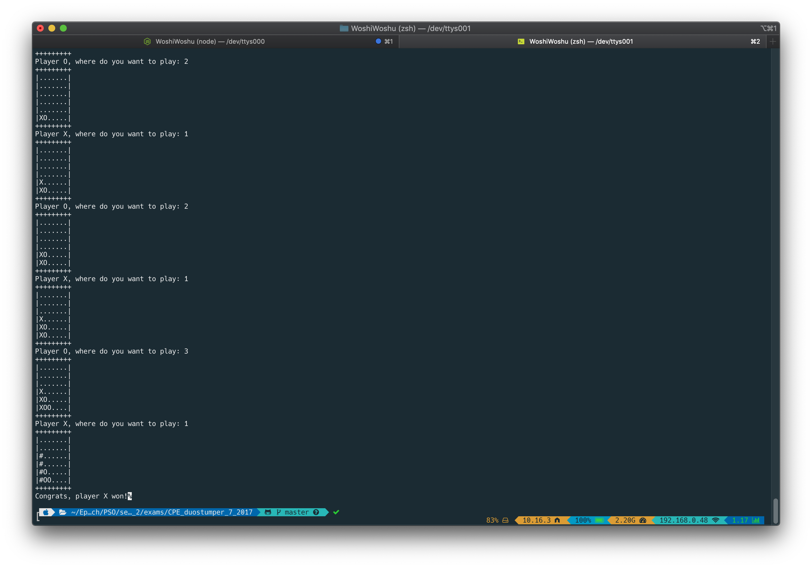

# CPE_duostumper_7_2017
First year mini project in C. The goal was to built a terminal version of the famous game "connect 4".
It is a 2 player game turn by turn.
Each turn players places 'X'/'O' on the map.
The first player to connect all the 'X'/'O' wins the game.

USING :
        
        Make
        
        ./connect4

